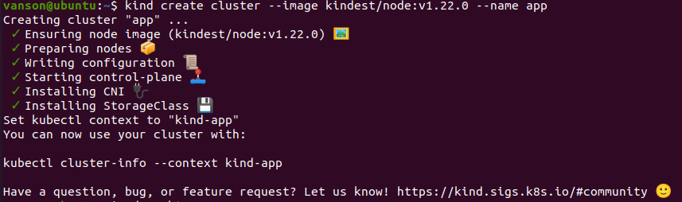
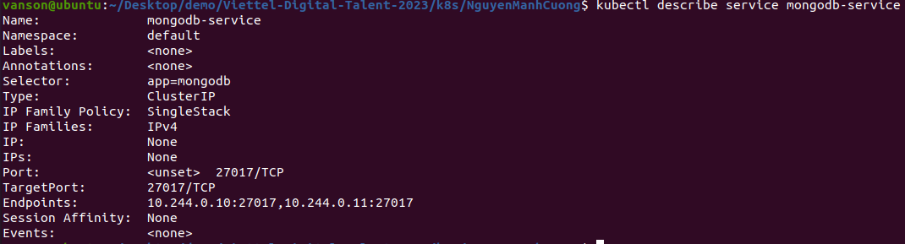
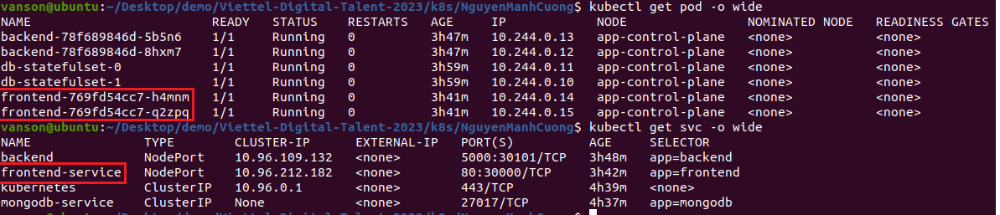

# Kubernetes Homework

# Table of contents
## [I. Kubernetes Overview](#1-kubernetes-overview)

-   ### [1 Introduction to Kubernetes](#11-introduction-to-kubernetes)
-   ### [2 Kubernetes Components](#12-kubernetes-components)
-   ### [3 Kubernetes Architecture](#13-kubernetes-architecture)

## [II. Homework](#2-homework)

-   ### [1 Installation](#21-installation)
-   ### [2 Configmap and Secret](#22-configmap-and-secret)
-   ### [3 Database Deployment and Service](#23-database-deployment-and-service)
-   ### [4 Backend Deployment and Service](#24-backend-deployment-and-service)
-   ### [5 Frontend Deployment and Service](#25-frontend-deployment-and-service)
-   ### [6 Result](#26-result)
# 1. Kubernetes Overview

## 1.1 Introduction to Kubernetes

**Kubernetes**, developed by Google, is an **open-source container orchestration tool** that facilitates the **management of containerized applications** across various deployment environments such as physical machines, virtual machines, cloud environments, and even hybrid deployments.

The trend towards *microservices*, the *increased usage of containers*, and the need to manage *large numbers of containers* efficiently have all driven the demand for container orchestration tools.

Kubernetes offers a wide range of features that facilitate the management and operation of containerized applications:

- High availability or no downtime
- Scalability or high performance
- Disaster recovery - backup and restore
- Load balancing and service discovery
- Rolling updates and rollbacks

## 1.2 Kubernetes Components

- **Node**: A server, either physical or virtual, that acts as a basic unit in Kubernetes.
- **Pod**: The smallest unit in Kubernetes, serving as an **abstraction over a container**. A Pod creates a runtime environment or layer on top of the container. Typically, each Pod runs a single application. Pods can communicate with each other using these IP addresses. If a Pod fails or is terminated, a new Pod is automatically created to replace it, and the new Pod will be assigned a new IP address during recreation.
- **Service**: Provides a static or **permanent IP address** for Pods. The lifecycle of Pods and Services is independent of each other. Services allow for stable network access to Pods, even if the Pods are replaced or relocated.
- **Ingress**: *Manages external access* to services within a cluster by routing incoming requests based on defined rules. It serves as an entrypoint for external traffic to reach services running in the cluster, allowing for load balancing, SSL termination, and URL-based routing.
- **ConfigMap**: Used to store **external configurations** for applications. It typically contains data such as database URLs or other service configurations. ConfigMaps provide a way to decouple application configurations from the container image, making it easier to manage and update configuration settings without modifying the application itself.
- **Secret**: Used to **store secret data** (in base64 encoded format)
- **Volumes**: Attaches a physical storage on hard drive to Pod and that storage could be either on a local machine or remote storage
- **Deployment**: In Kubernetes, a Deployment serves as a **blueprint** for creating and managing Pods. It allows you to define the desired number of replicas and provides the ability to scale the replicas up or down as needed. Deployments provide a higher-level **abstraction over Pods**, making it easier to interact with, replicate, and configure them.
- **StatefulSet**: Manages stateful applications like databases by handling Pod replication and scaling while ensuring synchronized database operations to maintain data consistency.

## 1.3 Kubernetes Architecture

**Worker Node**

In a Kubernetes cluster, each node hosts multiple Pods. The three essential processes installed on every node are:
  - **Container runtime**: Manages the execution of containers.
  - **Kubelet**: Interacts with the container and node, starting Pods with assigned resources.
  - **Kube-proxy**: Forwards requests from services to Pods, optimizing communication with low overhead. For example, if an application replica named "my-app" initiates a request to a database, Kube-proxy ensures that the request is forwarded to the replica running on the same node as the requesting Pod, minimizing network overhead.
  
Worker nodes perform the actual work in the Kubernetes cluster, requiring these processes to be installed.

<p align = "center">
 
<br>Picture 1. Worker Nodes with 3 processes (container runtime, kubelet and kube-proxy)
</p>

**Master Node**

4 processes run on every master node
- **API server**: The API server is the cluster gateway, receiving requests for updates or queries. Also it acts as a gatekeeper for authentication. To deploy a new application in a Kubernetes cluster, users interact with the API server using clients like the Kubernetes dashboard, Kubectl, or the Kubernetes API.
- **Scheduler**: Assigns Pods to specific worker nodes based on factors like resource availability and affinity rules. When a request to schedule a new Pod is received by the API server, it is passed to the scheduler, which decides on the optimal node for deployment. The actual process of starting the Pod and its containers is handled by the Kubelet.
- **Controller manager**: Detects pod failures and requests the scheduler to reschedule them on available nodes to restore the cluster's desired state.
- **etcd**: A key-value store that maintains the state of a Kubernetes cluster, storing changes such as pod scheduling and failures. It does not store application data.

In practice, a Kubernetes cluster is composed of multiple Master nodes, each running its own set of processes. The API server is load balanced, and the etcd store is distributed across all the Master nodes for reliable storage.

<p align = "center">
 
<br>Picture 2. Master Nodes with 4 processes (api server, scheduler, controller manager and etcd)
</p>

<p align = "center">
 
<br>Picture 3. Example cluster set-up
</p>

# 2. Homework

**Requirements**

*Assignment*: Deploy a Multi-tier Application on Kubernetes

*Objective*: The objective of this assignment is to apply the concepts learned in the hands-on labs and deploy a multi-tier application on Kubernetes. The application consists of a frontend web server, a backend API server, and a database.

*Instructions*:

- Design and create the necessary YAML files to deploy the following components:
- Frontend Deployment and Service: Deploy a frontend web server (e.g., Nginx) with multiple replicas. Expose the frontend service to access it from outside the cluster
- Backend Deployment and Service: Deploy a backend API server (e.g., Node.js, Flask, or any other framework) with multiple replicas. Expose the backend service within the cluster.
- Database Deployment and Service: Deploy a database (e.g., MySQL or PostgreSQL) with persistent storage for data persistence. Expose the database service within the cluster.
- Configure the appropriate networking between the frontend, backend, and database components. 
- The frontend should be able to communicate with the backend API server. The backend API server should be able to access the database for data storage and retrieval.
- Test the application by accessing the frontend web server from outside the cluster and verifying that it communicates with the backend API server and retrieves data from the database.
- Document the steps followed to deploy the application, including the YAML files created and any necessary configuration details.
- Submit the documentation and the YAML files as the assignment deliverables.

## 2.1 Installation

**Kind** and **Minikube** are tools for **local** Kubernetes development. Kind runs Kubernetes in Docker containers, providing a lightweight local cluster. Minikube creates a virtual machine to host the Kubernetes cluster, supporting additional features like multi-node clusters and container runtime integration.

In this particular exercise, I chose to use Kind for development

**Install Kind and create Cluster**

```shell
[ $(uname -m) = x86_64 ] && curl -Lo ./kind https://kind.sigs.k8s.io/dl/v0.19.0/kind-linux-amd64
[ $(uname -m) = aarch64 ] && curl -Lo ./kind https://kind.sigs.k8s.io/dl/v0.19.0/kind-linux-arm64
chmod +x ./kind
sudo mv ./kind /usr/local/bin/kind
kind create cluster --image kindest/node:v1.22.0
```
**Install kubectl**

kubectl - Command line tool for K8s cluster

```shell
snap install kubectl --classic
```

<p align = "center">
 
<br>Picture 4. Create Cluster Kubernetes using Kind
</p>

## 2.2 Configmap and Secret

**ConfigMap** is being used to store the **database URL**, where the key "database-url" is associated with the value "mongodb-service". You can use this ConfigMap in Kubernetes deployments, pods, or other resources by referencing the key and retrieving the associated value for the MongoDB database URL.

```yaml
apiVersion: v1
kind: ConfigMap
metadata:
  name: mongodb-configmap
data:
  database-url: mongodb-service
```
The **Secret** resource named "mongodb-secret" is created to store **sensitive data** related to a MongoDB database. The Secret contains two key-value pairs for the username and password, where the values are Base64-encoded to provide a level of obfuscation.
```yaml
apiVersion: v1
kind: Secret
metadata:
    name: mongodb-secret
type: Opaque
data:
    mongo-username: ZGJfdXNlcm5hbWU=
    mongo-password: ZGJfcGFzc3dvcmQ=
```

Apply the ConfigMap and Secret to the cluster:

```shell
kubectl apply -f mongodb_configmap.yaml
```

```shell
kubectl apply -f mongodb_secret.yaml
```

<p align = "center">
 
<br>Picture 5. ConfigMap and Secret in the Cluster
</p>

## 2.3 Database Deployment and Service

When deploying MongoDB in Kubernetes, using a **StatefulSet** instead of a Deployment is a recommended approach. A StatefulSet provides unique identities and stable network addresses for each replica, ensuring reliable and ordered scaling, rolling updates, and persistent storage.

**StatefulSet**

```yaml
apiVersion: apps/v1
kind: StatefulSet
metadata:
  name: db-statefulset
spec:
  replicas: 2
  selector:
    matchLabels:
      app: mongodb
  serviceName: mongodb-service
  template:
    metadata:
      labels:
        app: mongodb
    spec:
      containers:
      - name: mongodb
        image: mongo:5.0.17
        volumeMounts:
          - name: db-data
            mountPath: /data/db
        ports:
        - containerPort: 27017
        env:
        - name: MONGO_INITDB_ROOT_USERNAME
          valueFrom:
            secretKeyRef:
              name: mongodb-secret
              key: mongo-username
        - name: MONGO_INITDB_ROOT_PASSWORD
          valueFrom: 
            secretKeyRef:
              name: mongodb-secret
              key: mongo-password
              
  volumeClaimTemplates:
  - metadata:
      name: db-data
    spec:
      accessModes: [ "ReadWriteOnce" ]
      storageClassName: standard
      resources:
        requests:
          storage: 500Mi
```
- The StatefulSet is defined with the name ```db-statefulset```.
- The StatefulSet is configured with **two replicas** This will create and maintain two MongoDB instances.
- ```selector``` defines the label selector that the StatefulSet will use to match the Pods it manages. In this case, it matches the label app: mongodb.
- ```serviceName```: ```mongodb-service``` specifies the name of the associated Service for the StatefulSet.
- ```template``` defines the Pod template for the MongoDB instances.
- ```metadata``` section within the template defines the labels for the Pods.
- ```spec``` section within the template specifies the configuration for each MongoDB replica Pod.
- ```containers``` section defines the MongoDB container within each Pod.
- ```volumeMounts``` section configures the volume mount for persistent storage. It mounts a volume named db-data to the /data/db path within the container.
- ```env``` section sets environment variables for the MongoDB container. In this case, it specifies the MongoDB root username and password by referencing a **Secret** named ```mongodb-secret``` and its keys ```mongo-username``` and ```mongo-password```.
- ```volumeClaimTemplates``` section defines the **PersistentVolumeClaim (PVC)** template for each replica. It specifies the name, access mode, storage class, and resource requests for the volume claim.
  
By deploying this **StatefulSet** manifest, I will have two MongoDB instances running in the Kubernetes cluster, each with its own persistent storage and associated Service. The MongoDB instances will be accessible through the defined Service and can be configured with the specified root username and password from the referenced Secret.

In addition to the StatefulSet, see an example of a **Deployment** for deploying a database [here](./mongodb-deployment.yaml).

**Service**
```yaml
apiVersion: v1
kind: Service
metadata:
  name: mongodb-service
spec:
  selector:
    app: mongodb
  ports:
  - protocol: TCP
    port: 27017
    targetPort: 27017
```

**Apply a Statefulset and a Service for database in Cluster**

```shell
kubectl apply -f mongodb-statefulset.yaml
```
<p align = "center">
 
<br>Picture 6. Database Pods
</p>

<p align = "center">
 
<br>Picture 7. Service for database (mongodb-service)
</p>

<p align = "center">
 
<br>Picture 8. StatefulSet for database (db-statefulset)
</p>

## 2.4 Backend Deployment and Service

**Deployment**
```yaml
apiVersion: apps/v1
kind: Deployment
metadata:
  name: backend
spec:
  replicas: 2
  selector:
    matchLabels:
      app: backend
  template:
    metadata:
      labels:
        app: backend
    spec:
      containers:
      - name: backend
        image: vansonpt/api
        ports:
        - containerPort: 5000
        env:
        - name: USER_NAME
          valueFrom: 
            secretKeyRef:
              name: mongodb-secret
              key: mongo-username

        - name: USER_PWD
          valueFrom: 
            secretKeyRef:
              name: mongodb-secret
              key: mongo-password

        - name: DB_URL
          valueFrom: 
            configMapKeyRef:
              name: mongodb-configmap
              key: database-url
```

**Service**
```yaml
apiVersion: v1
kind: Service
metadata:
  name: backend
spec:
  type: NodePort
  selector:
    app: backend
  ports:
    - protocol: TCP
      port: 5000
      targetPort: 5000
      nodePort: 30101
```
By applying the provided Service YAML to the Kubernetes cluster, a Service named ```backend``` is created. This Service selects Pods with the label ```app: backend``` and forwards incoming traffic on port ```5000``` to the corresponding Pods' port ```5000```. Additionally, the Service is exposed on each cluster node's IP address at port ```30101``` (NodePort). This configuration enables external access to the Service by using the node's IP address and the specified NodePort.

```shell
kubectl apply -f backend_deployment.yaml
```

<p align = "center">
 
<br>Picture 9. Pods and Service for backend
</p>

## 2.5 Frontend Deployment and Service

**Deployment**
```yaml
apiVersion: apps/v1
kind: Deployment
metadata:
  name: frontend
spec:
  replicas: 2
  selector:
    matchLabels:
      app: frontend
  template:
    metadata:
      labels:
        app: frontend
    spec:
      containers:
      - name: frontend
        image: vansonpt/frontend
        ports:
        - containerPort: 80
```

**Service**

```yaml
apiVersion: v1
kind: Service
metadata:
  name: frontend-service
spec:
  type: NodePort
  selector:
    app: frontend
  ports:
    - protocol: TCP
      port: 80
      targetPort: 80
      nodePort: 30000
```

By applying this Service YAML to the Kubernetes cluster, a Service named ```frontend-service``` is created. The Service will select Pods with the label ```app: frontend``` and forward incoming traffic on port 80 to those Pods' port ```80```. It will also expose the Service on each cluster node's IP address at port ```30000``` (NodePort). This allows external access to the Service using the node's IP address and the specified NodePort.

```shell
kubectl apply -f frontend_deployment.yaml
```

<p align = "center">
 
<br>Picture 10. Pods and Service for frontend
</p>

## 2.6 Result

<p align = "center">
 
<br>Picture 11. Demo web frontend
</p>

<p align = "center">
 
<br>Picture 12. Demo web api
</p>