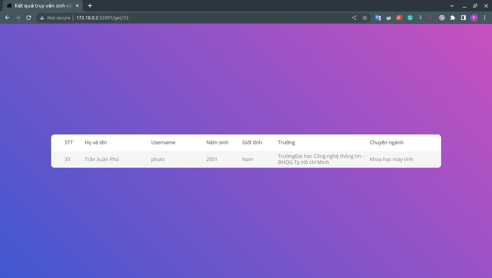

# Demo 3-tier web application sử dụng Kubernetes
## Check IP của node và port của frontend service
Để check IP của node dùng lệnh `kubectl get nodes -o wide`:

Tại phần `INTERNAL-IP` lấy được địa chỉ IP là `172.18.0.2`.

Tiếp theo sử dụng lệnh `kubectl get services` để kiểm tra port:

Port mà frontend expose là `32097`. 

Lưu ý: IP node và frontend port có thể khác nhau trên các thiết bị khác.
## Demo
Truy cập vào `http://172.18.0.2:32079`, ta được giao diện như sau:

Thực hiện truy vấn với stt là 33, ta truy cập vào `http://172.18.0.2:32079/get/33`:

