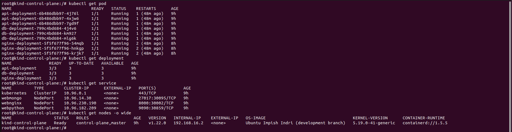
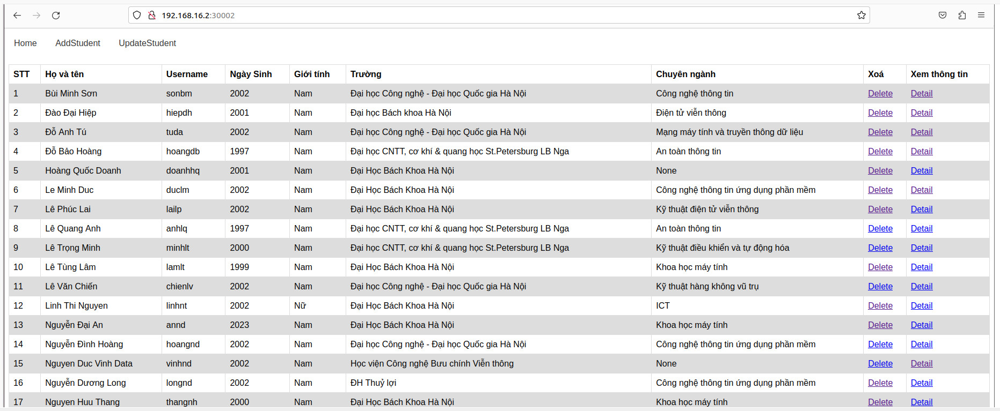

# Deploy a Multi-tier Application on Kubernetes

## Build web 3 Tiers

Sử dụng 3 images trong dockerhub

- Database: [chungnguyenngoc/k8s-webmongo](https://hub.docker.com/repository/docker/chungnguyenngoc/k8s-webmongo/general)
- Backend: [chungnguyenngoc/k8s-webpython](https://hub.docker.com/repository/docker/chungnguyenngoc/k8s-webpython/general)
- Frontend: [chungnguyenngoc/k8s-webnginx](https://hub.docker.com/repository/docker/chungnguyenngoc/k8s-webnginx/general)

## Chi tiết cài đặt

#### Install Kind and create Cluster
```sh
[ $(uname -m) = x86_64 ] && curl -Lo ./kind https://kind.sigs.k8s.io/dl/v0.19.0/kind-linux-amd64
[ $(uname -m) = aarch64 ] && curl -Lo ./kind https://kind.sigs.k8s.io/dl/v0.19.0/kind-linux-arm64
chmod +x ./kind
sudo mv ./kind /usr/local/bin/kind
docker pull kindest/node:v1.22.0
kind create cluster --image kindest/node:v1.22.0
```
```
docker ps
```
```
docker exec -it kind-control-plane bash
```

#### Create the database deployment (Mongodb) and  database service.

##### Create the database deployment

```yaml
apiVersion: apps/v1
kind: Deployment
metadata:
  name: db-deployment
spec:
  replicas: 3
  selector:
    matchLabels:
      app: db
  template:
    metadata:
      labels:
        app: db
    spec:
      containers:
      - name: mongodb-server
        image: chungnguyenngoc/k8s-webmongo
        ports:
        - containerPort: 27017
```
##### Create the database service:

```yaml
apiVersion: v1
kind: Service
metadata:
  name: webmongo
spec:
  selector:
    app: db
  ports:
  - protocol: TCP
    port: 27017
    targetPort: 27017
  type: NodePort
```

#### Create the backend deployment and  backend service

##### Create the backend deployment

```yaml
apiVersion: apps/v1
kind: Deployment
metadata:
  name: api-deployment
spec:
  replicas: 3
  selector:
    matchLabels:
      app: api
  template:
    metadata:
      labels:
        app: api
    spec:
      containers:
      - name: webpython
        image: chungnguyenngoc/k8s-webpython
        ports:
        - containerPort: 9090
```

#####  Create the backend service
```yaml
apiVersion: v1
kind: Service
metadata:
  name: webpython
spec:
  selector:
    app: api
  ports:
  - protocol: TCP
    port: 9090
    targetPort: 9090
  type: NodePort
```

#### Create the web deployment (Nginx) and web service
##### Create the web deployment (Nginx)
```yaml
apiVersion: apps/v1
kind: Deployment
metadata:
  name: nginx-deployment
spec:
  replicas: 3
  selector:
    matchLabels:
      app: nginx
  template:
    metadata:
      labels:
        app: nginx
    spec:
      containers:
      - name: nginx-container
        image: chungnguyenngoc/k8s-nginx
        ports:
        - containerPort: 8000
```

#####  Create the web service 
```yaml
apiVersion: v1
kind: Service
metadata:
  name: webnginx
spec:
  selector:
    app: nginx
  ports:
  - protocol: TCP
    port: 8000
    targetPort: 8000
    nodePort: 30002
  type: NodePort
EOF
```

## Result 
Lấy danh sách pod bằng lệnh 

```bash 
$ kubectl get pod 
```
Lấy danh sách deployment bằng lệnh

```bash 
$ kubectl get deployment 
```
Lấy danh sách Service bằng lệnh
```bash 
$ kubectl get deployment 
```
Kiểm tra các node

```bash 
$ kubectl get nodes -o wide
```



Web 



